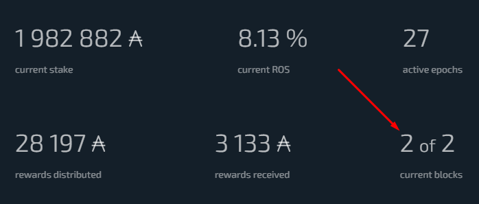

# adastat.net
Repository to keep track of issues and feature requests in AdaStat

## Using send_pool_blocks.sh
Pool operators can send to AdaStat the blocks quantity which assigned to the pool

This will show your concern for your delegators and will be able to see how many blocks the pool will create in the current epoch

Sending blocks every epochs will also allow us to calculate the ROS of your pool more accurately

To send the blocks quantity download the [send_pool_blocks.sh](./files/send_pool_blocks.sh), define the config variables with your own data and run it

> We recommend to send the blocks after 5-15 minutes after the beginning of the epoch, because the leaders logs on your node may be updated with a slight delay, so if you send blocks immediately after the beginning of the epoch, they may still be empty

No registration on https://adastat.net/ required
